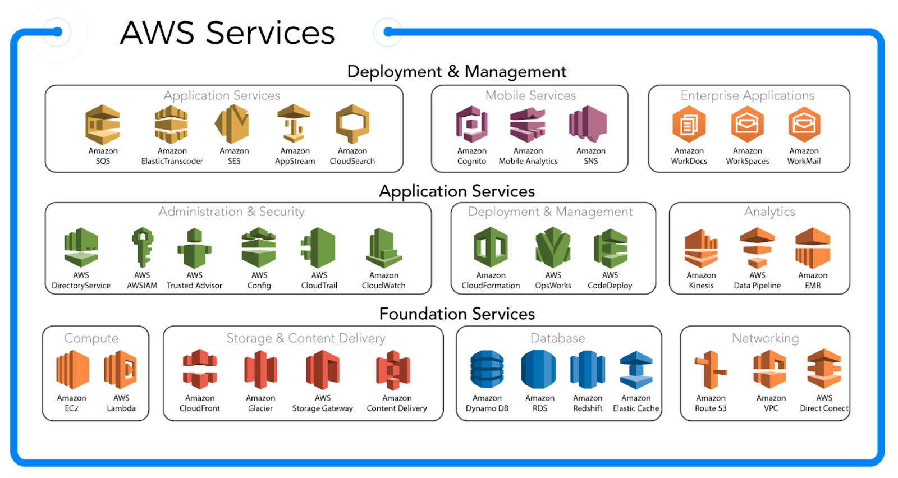
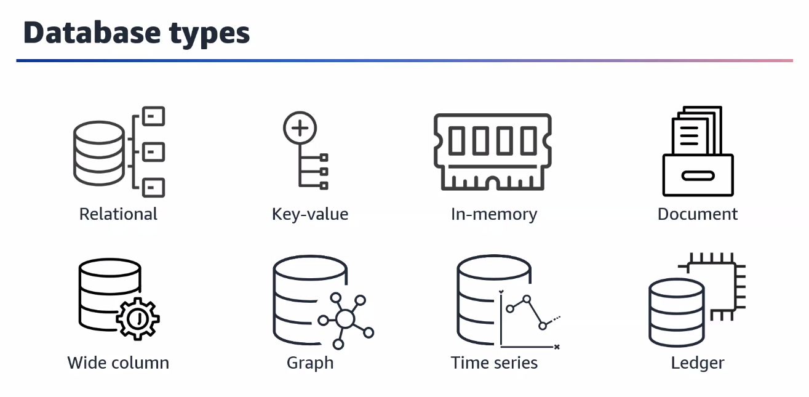
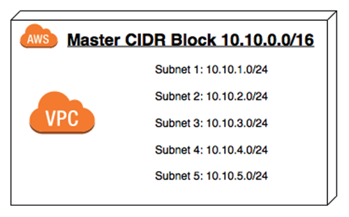

# KnowledgeTransfer

This sums up my learnings during my Razorpay Internship.


## Learning

- Continuous Integration / Continuous Delivery & Deployment (CI | CD)

- GitHub Actions & GitHub Marketplace

- Docker

- Kubernetes

- Amazon Web Service 

    

     - Architecture
        - AWS Cloud
            - Region 1
                - Availability Zone 1
                - Availability Zone 2
                - Availability Zone 3
            - Region 2
                - Availability Zone 1
                - Availability Zone 2
                - Availability Zone 3
            - Region 3
                - Availability Zone 1
                - Availability Zone 2
                - Availability Zone 3

    - IAM
        > *Identity that represents a person or application that interacts with the AWS services and resources.*
        > *The user gets access to the resources on the basis of the IAM policies which is a JSON based document.*
        > *Collection of IAM users can be grouped where the policies can be inherited.*
    
    - AWS Compute
        - Instance
            - Classification and Specification
                - General Purpose
                - Compute Optimized
                - Memory Optimized
                - Accelerated Computing
                - Storage Optimized
            - Elastic Compute Cloud (EC2)
                - Amazon Machine Image (AMI)
        - Container
            - Amazon Container Service (ECS)
            - Amazon Elastic Kubernetes Service (EKS)
        - Serverless
            - AWS Fargate
            - AWS Lambda

    

    - AWS Storage
        - Block Storage
            - Instance Store (Non-persistent fast storage just like RAM)
            - Elastic Block Store (EBS)
                - SSD (NVMe used by Amazon)
                - HDD
                - Deployed at only one Availability Zone
        - File Storage
            - Elastic File System (EFS) (For Linux)
                - Shared storage between multiple Availability Zone
            - FSx (For Windows)
        - Object Storage (Object = Data + Metadata + Key)
            - Simple Storage Service (S3 Bucket)
                - Regional Service (Available in a particular region only)
                - Global Namespace (Name/Link to the resource is globally available hence must be unique for each regions)

        > *EBS = SAN (Storage Area Network) while EFS = NAS (Network Attached Storage)*

    - AWS Databases

        

        - Relational Database Service (RDS) [SQL]
            - Amazon Aurora
            - Microsoft SQL
            - MariaDB
            - MySQL
        - Amazon DynamoDB [NoSQL]
            - Key-Value Database
            - Serverless in nature

    - AWS Networking
        
      

        - Classless Inter-Domain Routing (CIDR)
        
          

        - Network Acknowledgement NACL (Stateless)
        - Security Group  (Stateful)

    - Monitoring, Load Balancing and Scaling

        - Amazon CloudWatch (Monitoring)
        - Elastic Load Balancing 
            - Application Load Balancer 
            - Network Load Balancer
            - Gateway Load Balancer
            - Classic Load Balancer

            > *Client requests hit an elastic load balancer as a single point of contact and then the requests are rerouted to multiple EC2 instances thereby balancing the traffic*  

    - Scaling

        - Vertical Scaling 
            > *Increase or Scale by increasing the metrics of the previous resource*
        - Horizontal Scaling
            > *Increase or Scale by increasing the number of resources keeping individual metrics of the resources constant*
        - EC2 Auto Scaling
        
    - Misc. Tools
        - Elastic Beanstalk
        - Amazon Route 53
    
- Base64 Encoding

    - Purpose

        > *Base64 encoding is a method used to convert binary data into ASCII text format.* 
        > *It is widely used in computer systems, particularly for tasks such as data transmission,* 
        > *file attachments in emails, and data storage.*
        >
        > *The purpose of base64 encoding is to ensure that binary data can be safely transmitted or* 
        > *stored using systems that only support text-based formats. Since many systems and protocols* 
        > *can only handle ASCII characters, base64 encoding allows binary data to be represented as a* 
        > *string of ASCII characters.* 
        >
        > *ASCII representation uses 7-bits or 128 unique characters. However, currently UTF-8 is widely*
        > *used and there are a number of other characters that needs to be represented and transmitted* 
        > *base64 encoding ensures that no matter how many characters are used to represent the original* 
        > *binary file, the information can be encoded in base64. 64 unique characters from [A-Za-z0-9+/]*
        > *are used for encoding*  

    - Implementation
        > 1. *The input binary data is divided into groups of three bytes.*
        > 2. *Each group of three bytes is then split into four 6-bit segments.*
        > 3. *Each 6-bit segment is represented as a character using a predefined set of 64 ASCII characters.* 
        >    *The specific set of characters used may vary,  but it typically includes uppercase letters, lowercase*
        >    *letters, numbers, and two additional characters, often '+' and '/'.*
        > 4. *If the input binary data is not divisible by three, padding characters (usually '=') are added to the* 
        >    *encoded output to ensure that the length is a multiple of four characters.*

        
        

    - Commands (Linux/macOS)
        - Encoding
        ```console
            base64 <input_file_name> > <output_file_name>
        ```
        - Decoding
        ```console
            base64 -d <input_file_name> > <output_file_name>
        ```
        - Print the encoded string on the terminal
        ```console
            base64 <input_file_name>
        ``` 
        - Decoding from a encoded string
        ```console
            echo <encoded_string> | base64 -d > <output_file_name>
        ```

## Book Suggestions

- Girish
    - Concrete Mathematics - Knuth, Graham
    - All of Stats - Wasserman 
    - Statistical Design - Casella 
    - Modern Age Statistical Inference - Efron, Hastie
    - Elements of Statistical Learning - Hastie, Tibshirani
    - Probabilistic ML - Kevin Murphy
    - Deep Learning - Bengio, Goodfellow
- Murali
    - Auth N Capture - Aditya Kulkarni