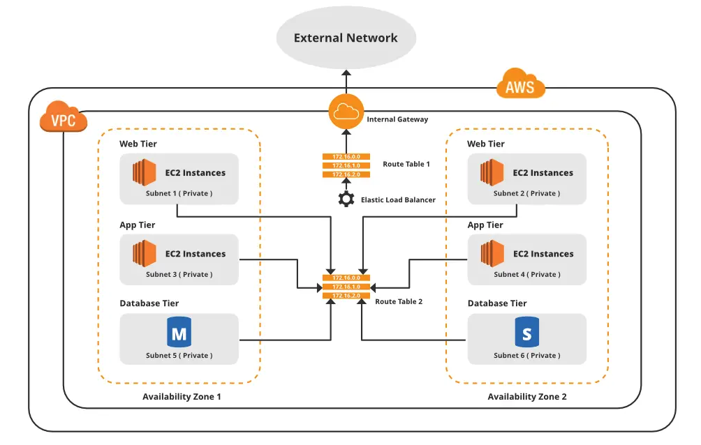
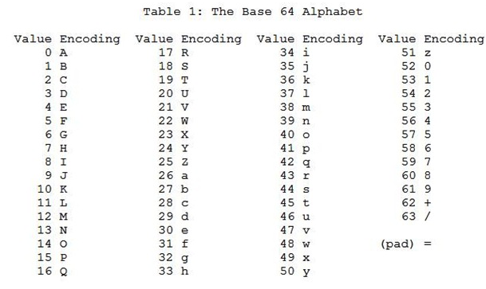
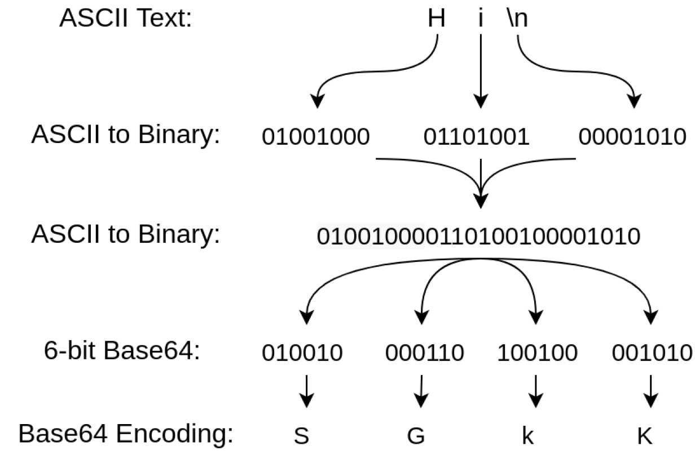

# [KnowledgeTransfer](https://github.com/sanam2405/KnowledgeTransfer)

## [Manas Pratim Biswas](https://github.com/sanam2405) (SDE Intern, DevSecOps@[Razorpay](https://razorpay.com/))

This sums up my workflows and learnings during my Razorpay Internship.

## Workflow Diagrams

- **Cloud Automation and Remediation**

    
    
    

<!-- | Lambda Idea                           | Lambda Workflow                           |
| --------------------------------------|-------------------------------------------|
|   |   | -->

- **Scanning all the Stages of each Pipelines of Spinnaker Applications for Security Checks**

    

- **Security Dashboard Migration from Looker to Superset**

    

## Learning

- Continuous Integration / Continuous Delivery & Deployment (CI / CD)

- GitHub Actions & GitHub Marketplace

- Dependabot, Semgrep, Trivy, Pingsafe

- Docker, Kubernetes

- Looker, Superset, Querybook, Postman

- Amazon Web Service

    

  - Architecture

    - AWS Cloud
      - Region 1
        - Availability Zone 1
        - Availability Zone 2
        - Availability Zone 3
      - Region 2
        - Availability Zone 1
        - Availability Zone 2
        - Availability Zone 3
      - Region 3
        - Availability Zone 1
        - Availability Zone 2
        - Availability Zone 3

  - IAM

    > _Identity that represents a person or application that interacts with the AWS services and resources._ > _The user gets access to the resources on the basis of the IAM policies which is a JSON based document._ > _Collection of IAM users can be grouped where the policies can be inherited._

     

    - User Role - IAM User Role defines the access to the resources and services that the user has

    - Service Role - IAM Service Role defines the services that can be accessed by a particular AWS service. Service like EC2, S3, DynamoDB can be accessed by a Lambda if the
      service role of the Lambda contains the policies to access the EC2, S3, DynamoDB services

    - Configuring a Lambda function (suppose deployed in Account A) to assume a role from another AWS account (suppose in Account B)

      > _ARN of the **role to be assumed** in the Account B should be configured in the **execution role** of the Lambda in Account A as an **in-line policy**_
      >
      > _ARN of the **execution role** of the Lambda in Account A should be configured in the **Trust Policy** of the **role to be assumed** in the Account B_

     

  - AWS Compute

    - Instance
      - Classification and Specification
        - General Purpose
        - Compute Optimized
        - Memory Optimized
        - Accelerated Computing
        - Storage Optimized
      - Elastic Compute Cloud (EC2)
        - Amazon Machine Image (AMI)
    - Container
      - Amazon Container Service (ECS)
      - Amazon Elastic Kubernetes Service (EKS)
    - Serverless
      - AWS Fargate
      - AWS Lambda

    

  - AWS Storage

    - Block Storage
      - Instance Store (Non-persistent fast storage just like RAM)
      - Elastic Block Store (EBS)
        - SSD (NVMe used by Amazon)
        - HDD
        - Deployed at only one Availability Zone
    - File Storage
      - Elastic File System (EFS) (For Linux)
        - Shared storage between multiple Availability Zone
      - FSx (For Windows)
    - Object Storage (Object = Data + Metadata + Key)
      - Simple Storage Service (S3 Bucket)
        - Regional Service (Available in a particular region only)
        - Global Namespace (Name/Link to the resource is globally available hence must be unique for each regions)

    > _EBS = SAN (Storage Area Network) while EFS = NAS (Network Attached Storage)_

  - AWS Databases

      

    - Relational Database Service (RDS) [SQL]
      - Amazon Aurora
      - Microsoft SQL
      - MariaDB
      - MySQL
    - Amazon DynamoDB [NoSQL]
      - Key-Value Database
      - Serverless in nature

  - AWS Networking

    

    - Classless Inter-Domain Routing (CIDR)

      

    - Network Acknowledgement NACL (Stateless)
    - Security Group (Stateful)

  - Monitoring, Load Balancing and Scaling

    - Amazon CloudWatch (Monitoring)
    - Elastic Load Balancing

      - Application Load Balancer
      - Network Load Balancer
      - Gateway Load Balancer
      - Classic Load Balancer

      > _Client requests hit an elastic load balancer as a single point of contact and then the requests are rerouted to multiple EC2 instances thereby balancing the traffic_

  - Scaling

    - Vertical Scaling
      > _Increase or Scale by increasing the metrics of the previous resource_
    - Horizontal Scaling
      > _Increase or Scale by increasing the number of resources keeping individual metrics of the resources constant_
    - EC2 Auto Scaling

  - Misc. Tools
    - Elastic Beanstalk
    - Amazon Route 53

- Base64 Encoding

  - Purpose

    > _Base64 encoding is a method used to convert binary data into ASCII text format._ > _It is widely used in computer systems, particularly for tasks such as data transmission,_ > _file attachments in emails, and data storage._
    >
    > _The purpose of base64 encoding is to ensure that binary data can be safely transmitted or_ > _stored using systems that only support text-based formats. Since many systems and protocols_ > _can only handle ASCII characters, base64 encoding allows binary data to be represented as a_ > _string of ASCII characters._
    >
    > _ASCII representation uses 7-bits or 128 unique characters. However, currently UTF-8 is widely_ > _used and there are a number of other characters that needs to be represented and transmitted_ > _base64 encoding ensures that no matter how many characters are used to represent the original_ > _binary file, the information can be encoded in base64. 64 unique characters from [A-Za-z0-9+/]_ > _are used for encoding_

  - Implementation

    > 1. _The input binary data is divided into groups of three bytes._
    > 2. _Each group of three bytes is then split into four 6-bit segments._
    > 3. _Each 6-bit segment is represented as a character using a predefined set of 64 ASCII characters._ > _The specific set of characters used may vary, but it typically includes uppercase letters, lowercase_ > _letters, numbers, and two additional characters, often '+' and '/'._
    > 4. _If the input binary data is not divisible by three, padding characters (usually '=') are added to the_ > _encoded output to ensure that the length is a multiple of four characters._

    ***

      
       
      ---
      

    ***

      

  - Commands (Linux/macOS)
    - Encoding
    ```console
        base64 <input_file_name> > <output_file_name>
    ```
    - Decoding
    ```console
        base64 -d <input_file_name> > <output_file_name>
    ```
    - Print the encoded string on the terminal
    ```console
        base64 <input_file_name>
    ```
    - Decoding from a encoded string
    ```console
        echo <encoded_string> | base64 -d > <output_file_name>
    ```

- Hashing and Encryption

  - Secure Hash Algorithm (SHA)
  - Message Digest Algorithm (MD5)

- Polling, Streaming and WebHooks

  - Polling

    > _Continuously poll the server at regular intervals of time. This might_ > _be inefficient at times since frequent redundant polls might occur_

  - Streaming

    > _Establishing a continuous two-way connection with the server and_ > _continuously listening to the server. Puts huge load on the server_

  - WebHooks

    > _Communicates with the server based on the trigger for an event. Whenever_ > _the event is triggered, the webhook send a response thereby reducing load_ > _on the server_

## Book Suggestions

- Girish
  - Concrete Mathematics - Knuth, Graham
  - All of Stats - Wasserman
  - Statistical Design - Casella
  - Modern Age Statistical Inference - Efron, Hastie
  - Elements of Statistical Learning - Hastie, Tibshirani
  - Probabilistic ML - Kevin Murphy
  - Deep Learning - Bengio, Goodfellow
- Murali
  - Auth N Capture - Aditya Kulkarni
